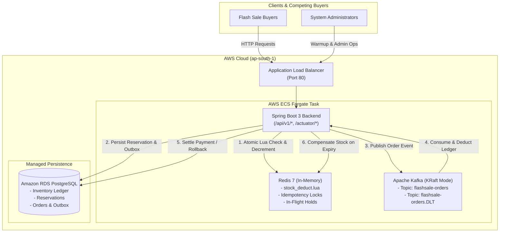

# ⚡ FlashSale: Enterprise Distributed Flash Sale System

A high-concurrency, fault-tolerant Flash Sale and E-Commerce platform built with **Spring Boot 3, Apache Kafka, Redis, PostgreSQL, and AWS ECS Fargate**, engineered to handle massive burst traffic with a **Zero-Overbooking Guarantee**.

---

## 🏛️ System Architecture



---

## 🚀 Key Architectural Pillars

### 1. Zero-Overbooking Hot Path Engine
- **Redis Lua Scripting (`stock_deduct.lua`)**: Executes atomic stock decrement, user duplicate hold verification, and reservation token generation in a single atomic cycle (<10ms).
- **Rate-Limiting & Idempotency**:
  - `RateLimitFilter`: Token bucket rate-limiting extracting `X-Forwarded-For` from ALB headers.
  - `@Idempotent` annotation with Redis distributed locks preventing duplicate checkouts.

### 2. Event-Driven Order Pipeline (Apache Kafka)
- **Unified Kafka Architecture**: Processes asynchronous order dispatch via `flashsale-orders` topic.
- **Consumer Group**: Multi-threaded concurrency with transactional DB persistence.
- **Dead-Letter Topic (DLT)**: Automated dead-letter publishing (`flashsale-orders.DLT`) for unrecoverable errors with exponential backoff.

### 3. Automated Expiry & Stock Compensation
- **Background Auto-Release Worker (`ReservationExpiryScheduler`)**: Runs every 5 seconds, identifies abandoned reservations past their 10-minute hold window, transitions DB status to `EXPIRED`, and atomically restores Redis stock (`INCRBY`).
- **Payment Failure Compensation**: Restores PostgreSQL reserved ledger and Redis in-memory cache upon payment failure/cancellation.

### 4. Real-Time Observability
- **Prometheus Endpoint**: `GET /actuator/prometheus`
- **Micrometer Metrics**:
  - `flashsale.reservation.latency` (P50, P95, P99)
  - `flashsale.checkout.latency` (P50, P95, P99)
  - `flashsale.reservations.active` (In-flight gauge)
  - `flashsale.reservations.success` / `failed` / `expired`
  - `flashsale.orders.success` / `soldout`

---

## 📡 Live Production Endpoints

- **ALB Base URL**: `http://flashsale-alb-1698354449.ap-south-1.elb.amazonaws.com`
- **Health Check**: `GET /actuator/health`
- **Prometheus Metrics**: `GET /actuator/prometheus`
- **Swagger UI**: `GET /swagger-ui.html`
- **OpenAPI Spec**: `GET /v3/api-docs`

---

## 🧪 Testing & Verification Scripts

### 1. Full 7-Stage End-to-End Test Suite
Executes health checks, admin warmup, atomic buyer reservations, Kafka order dispatch, payment settlement, and stock compensation rollback:
```powershell
cd C:\Users\Coffi\Downloads\flashsale
.\test-flashsale.ps1 -BaseUrl "http://flashsale-alb-1698354449.ap-south-1.elb.amazonaws.com"
```

### 2. High-Concurrency Stress Test (500 Buyers vs 100 Stock)
```powershell
cd C:\Users\Coffi\Downloads\flashsale
.\stress-test.ps1 -BaseUrl "http://flashsale-alb-1698354449.ap-south-1.elb.amazonaws.com" -TotalBuyers 500 -TotalStock 100 -Concurrency 25
```
